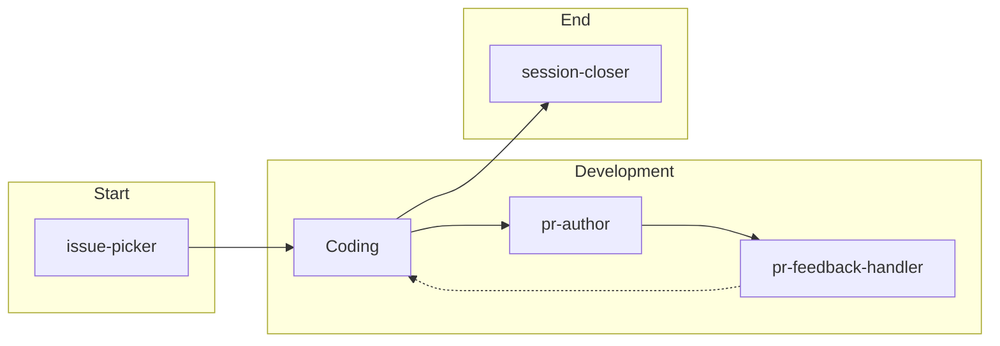

# Sovereign

Blockchain-native logic puzzle inspired by the classic n-Queens problem.

- Daily deterministic puzzles with on-chain verification
- Commit–reveal verification and collectible rewards (NFT/SBT)

## Structure

- `apps/web` — Next.js 14 (App Router) frontend
- `packages/engine` — Puzzle generation and validation
- `packages/onchain` — ABIs and contract addresses
- `contracts/` — Solidity smart contracts (Foundry)
- `docs/` — Documentation

## Blockchain Integration

**Implemented:**

- Chainlink VRF for verifiable random seed generation
- Commit-reveal contest flow with on-chain verification

**Investigating:**

- Chainlink Automation for scheduled puzzle releases
- Chainlink Runtime Environment (CRE) workflows

## Development

- Node 20 (see .nvmrc): `nvm use`
- Yarn (pinned): `yarn -v` should match repo setting
- Install: `corepack enable && yarn install`
- Scripts: `yarn build`, `yarn test`, `yarn lint`, `yarn format`
- Web tests: `yarn workspace web test`; e2e: `yarn workspace web e2e`

## Agent-Driven Development

This project uses AI-assisted development with [Claude Code](https://claude.ai/claude-code) and GitHub as the source of truth for project management.

### Milestones

| Milestone                 | Focus                             |
| ------------------------- | --------------------------------- |
| M1: Testnet MVP           | Core gameplay loop on Sepolia     |
| M2: Polish & UX           | Mobile, accessibility, animations |
| M3: Production Deployment | Multi-chain support, Base mainnet |
| M4: Automation & Indexing | Chainlink Automation, The Graph   |

### Custom Agents

Project-specific agents in `.claude/agents/`:

| Agent              | Purpose                                           |
| ------------------ | ------------------------------------------------- |
| `issue-picker`     | Select next issue from current milestone          |
| `issue-creator`    | Create standardized issues with labels/milestones |
| `milestone-status` | Progress reporting for planning                   |
| `session-closer`   | End-of-session bookkeeping                        |

### Workflow

1. **Start session** — Run `issue-picker` to select work
2. **Create branch** — `git checkout -b feat/issue-description`
3. **Implement** — Follow code style in `CLAUDE.md`
4. **PR creation** — Use `pr-author` agent, link to issue
5. **End session** — Run `session-closer` to capture progress

See `CLAUDE.md` for detailed guidelines and commands.
